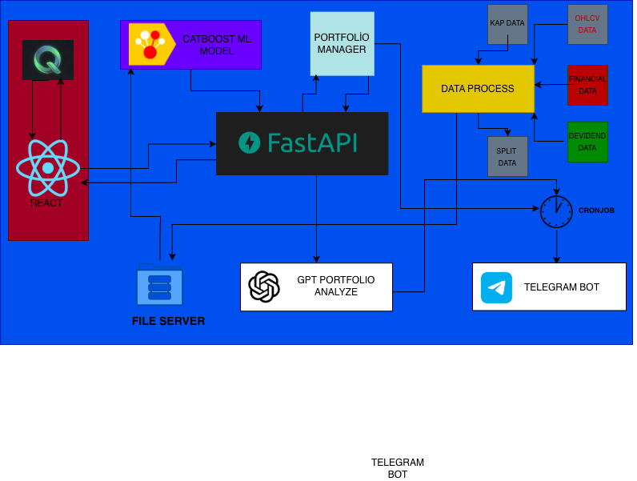

# QuantTrade - Algorithmic Trading Platform

**Systematic Momentum Strategy** for BIST-100 stocks with ML-driven portfolio management, automated execution, and AI-powered risk analysis.

## 📊 Overview

QuantTrade is a complete algorithmic trading system that:
- Fetches daily market data (prices, fundamentals, macro indicators)
- Trains ML models to rank stocks by momentum potential
- Manages a live portfolio with strict risk controls (T+1, max 5 positions, 5% stop-loss)
- Provides AI-powered portfolio analysis via GPT
- Sends automated Telegram reports and handles on-demand queries
- Offers a real-time web dashboard for monitoring

---

## 🏗️ Architecture

### System Architecture




### System Components


### Data Flow

```
1. Data Collection (19:00 daily)
   ├─ EVDS API → Macro indicators (interest rates, inflation)
   ├─ İş Yatırım API → Stock OHLCV data
   └─ Mali Tablo API → Fundamental data

2. Feature Engineering
   ├─ Technical indicators (momentum, volatility, trends)
   ├─ Sector normalization
   └─ Risk signals (stagnation, relative strength)

3. Model Training (Sunday 16:00)
   ├─ Train CatBoost classifier
   ├─ Sector-aware feature scaling
   └─ Save model + metadata

4. Portfolio Management (19:30 daily)
   ├─ Execute pending buy orders (T+1)
   ├─ Apply stop-loss rules (intraday)
   ├─ Plan exits (performance, time, stagnation)
   ├─ Generate new buy signals (top 5 momentum)
   └─ Save state: live_state_T1.json

5. GPT Analysis (19:45 daily)
   ├─ Read portfolio snapshot
   ├─ Call OpenAI GPT-4 API
   ├─ Risk scoring (0-100) per position
   ├─ Format for Telegram (<4000 chars)
   └─ Save: gpt_analysis_latest.json

6. Telegram Broadcast (19:50 daily)
   ├─ Portfolio summary
   ├─ GPT analysis
   └─ Send to all subscribers
```

---

## 📁 Project Structure

```
QuantTrade/
├── backend/                    # FastAPI backend
│   ├── api/routes/            # API endpoints
│   │   ├── portfolio.py       # Portfolio state, equity, trades
│   │   ├── pipeline.py        # Data pipeline control
│   │   ├── telegram.py        # Telegram broadcast
│   │   └── gpt.py            # GPT analysis API
│   ├── services/              # Business logic
│   │   ├── portfolio_service.py
│   │   ├── pipeline_service.py
│   │   ├── gpt_service.py
│   │   └── telegram_service.py
│   ├── models/                # Data models
│   │   ├── schemas.py         # Pydantic schemas
│   │   └── database.py        # SQLite (optional)
│   ├── config.py              # Settings
│   └── main.py               # FastAPI app

├── frontend/                   # React dashboard
│   ├── src/
│   │   ├── components/
│   │   │   ├── StatsGrid.tsx        # Portfolio metrics
│   │   │   ├── PositionsTable.tsx   # Active positions
│   │   │   ├── EquityChart.tsx      # Equity curve
│   │   │   ├── GPTAnalysis.tsx      # AI analysis modal
│   │   │   └── PipelineView.tsx     # Pipeline control
│   │   ├── services/api.ts          # API client
│   │   └── App.tsx                  # Main app
│   └── package.json

├── live-telegram/              # Telegram bot
│   ├── telegram_bot/
│   │   ├── bot_handler.py     # Command handlers
│   │   └── telegram_notify.py # Notification utility
│   ├── gpt_daily_sender.py    # Daily GPT broadcast
│   └── portfolio_daily_sender.py  # Portfolio broadcast

├── src/quanttrade/            # Trading engine
│   ├── data_sources/
│   │   ├── evds_client.py     # Turkish Central Bank API
│   │   ├── isyatirim_ohlcv.py # Stock price data
│   │   └── mali_tablo.py      # Financial statements
│   ├── models_2.0/
│   │   ├── live_portfolio_v2.py    # Portfolio manager (T+1)
│   │   ├── gpt_snapshot.py         # Portfolio snapshot
│   │   ├── gpt_analyze.py          # GPT-4 analysis
│   │   └── train_model.py          # ML model training
│   └── config.py              # Data pipeline config

├── scripts/                    # Cron job scripts
│   ├── cron_daily_data.sh     # 19:00 - Data download
│   ├── cron_portfolio_v2.sh   # 19:30 - Portfolio update
│   ├── cron_portfolio_telegram.sh  # 19:35 - Portfolio report
│   ├── cron_gpt_snapshot.sh   # 19:40 - GPT snapshot
│   ├── cron_gpt_analyze.sh    # 19:45 - GPT analysis
│   ├── cron_gpt_telegram.sh   # 19:50 - GPT broadcast
│   ├── cron_full_pipeline.sh  # Sunday 16:00 - Full pipeline
│   └── crontab.txt            # Crontab template

├── data/master/               # Master dataset
│   └── master_df.csv          # All features + labels

├── .env                       # Environment variables
├── requirements.txt           # Python dependencies
├── ecosystem.config.js        # PM2 configuration
└── README.md                  # This file
```

---

## 🚀 Features

### 1. Portfolio Management (V2)
- **T+1 Execution**: Buy/sell orders execute at next day's open
- **Max 5 Positions**: Concentration risk control
- **5% Stop-Loss**: Automatic risk cut (intraday execution)
- **Momentum Strategy**: ML-ranked top signals
- **Exit Rules**:
  - Performance failure (relaxed: 8 days + weak RS)
  - Stagnation (3+ days dormant)
  - Time exit (20 days max hold)
  - Model take-profit (+10% and no longer top-ranked)

### 2. ML Model (CatBoost)
- **Binary Classifier**: Predicts 20-day forward returns > threshold
- **Features**: 50+ technical + fundamental + macro indicators
- **Sector Normalization**: Standardizes features by sector
- **Training**: Weekly (Sunday 16:00) on historical data
- **Backtested**: ~50% annual return (T+1, costs included)

### 3. GPT Analysis
- **OpenAI GPT-4**: Portfolio risk analysis
- **Risk Scoring**: 0-100 per position (momentum, stagnation, stop-loss proximity)
- **System Compliance**: Checks rule adherence
- **Telegram-Optimized**: <4000 chars, emoji-rich, user-friendly
- **No Trade Signals**: Only risk assessment & monitoring

### 4. Telegram Bot
**Commands:**
- `/start` - Welcome & chat ID
- `/subscribe` - Auto-subscribe to reports
- `/unsubscribe` - Unsubscribe
- `/status` - Check subscription
- `/gpt` - Latest GPT analysis
- `/trade` - Run portfolio manager (admin only)

**Auto Reports (19:50 daily):**
- Portfolio summary (positions, P&L, pending orders)
- GPT risk analysis (formatted for Telegram)

### 5. Web Dashboard
- **Portfolio Metrics**: Equity, cash, positions, daily return
- **Positions Table**: Live P&L, entry/current prices
- **Equity Chart**: Historical equity curve
- **GPT Analysis Modal**: AI insights (auto-refresh every 5 min)
- **Pipeline Control**: Start/stop data pipeline, view logs

---

## ⚙️ Technology Stack

### Backend
- **FastAPI** - High-performance async API
- **Pydantic** - Data validation
- **Python 3.10+** - Core language
- **Uvicorn** - ASGI server

### Frontend
- **React 18** - UI framework
- **Vite** - Build tool
- **TypeScript** - Type safety
- **Tailwind CSS** - Styling
- **Recharts** - Data visualization
- **Lucide React** - Icons

### ML & Data
- **CatBoost** - Gradient boosting
- **Pandas** - Data manipulation
- **NumPy** - Numerical computing
- **Scikit-learn** - ML utilities

### Telegram
- **python-telegram-bot** - Bot framework
- **Asyncio** - Async handlers

### AI
- **OpenAI GPT-4** - Portfolio analysis
- **LangChain** (optional) - Prompt engineering

### DevOps
- **PM2** - Process manager
- **Nginx** - Reverse proxy
- **Cron** - Job scheduler
- **Git** - Version control

---

## 📦 Installation

### Prerequisites
- Python 3.10+
- Node.js 18+
- Git

### 1. Clone Repository
```bash
git clone https://github.com/yourusername/QuantTrade.git
cd QuantTrade
```

### 2. Backend Setup
```bash
# Create virtual environment
python3 -m venv .venv
source .venv/bin/activate  # On Windows: .venv\Scripts\activate

# Install dependencies
pip install -r requirements.txt

# Configure environment
cp .env.example .env
# Edit .env with your API keys
```

### 3. Frontend Setup
```bash
cd frontend
npm install
```

### 4. Environment Variables

Edit `.env`:
```bash
# OpenAI
OPENAI_API_KEY=sk-proj-...

# Telegram
TELEGRAM_BOT_TOKEN=123456789:ABC...
TELEGRAM_BOT_USERNAME=@your_bot

# APIs
EVDS_API_KEY=your_evds_key
BACKEND_API_URL=http://localhost:8000

# Frontend
VITE_API_URL=http://localhost:8000
```

---

## 🎯 Usage

### Local Development

**Start Backend:**
```bash
cd backend
python3 main.py
# Runs on http://localhost:8000
```

**Start Frontend:**
```bash
cd frontend
npm run dev
# Runs on http://localhost:3000
```

**Start Telegram Bot:**
```bash
cd live-telegram/telegram_bot
python3 bot_handler.py
```

### Run Pipeline Manually
```bash
# Download daily data
python3 run_daily_prices.py

# Update portfolio
python3 src/quanttrade/models_2.0/live_portfolio_v2.py

# Generate GPT analysis
cd src/quanttrade/models_2.0
python3 gpt_snapshot.py
python3 gpt_analyze.py
```

---

## 🌐 VDS Deployment

### 1. Copy Files to VDS
```bash
scp -r QuantTrade root@your_vds_ip:/root/
```

### 2. Install Dependencies
```bash
ssh root@your_vds_ip
cd /root/QuantTrade

# Python
python3 -m venv .venv
source .venv/bin/activate
pip install -r requirements.txt

# Node.js
cd frontend
npm install
npm run build
```

### 3. Configure Environment
```bash
# Set timezone
sudo timedatectl set-timezone Europe/Istanbul

# Create log directory
sudo mkdir -p /var/log/quanttrade

# Make scripts executable
chmod +x scripts/cron_*.sh
```

### 4. Setup PM2
```bash
# Install PM2
npm install -g pm2

# Start services
pm2 start ecosystem.config.js

# Save configuration
pm2 save
pm2 startup
```

### 5. Setup Cron Jobs
```bash
crontab -e
# Copy contents from scripts/crontab.txt
```

### 6. Configure Nginx
```nginx
server {
    listen 80;
    server_name your_domain.com;

    # API proxy
    location /api/ {
        proxy_pass http://localhost:8000;
        proxy_set_header Host $host;
    }

    # Frontend
    location / {
        root /root/QuantTrade/frontend/dist;
        try_files $uri /index.html;
    }
}
```

---

## 📅 Daily Workflow

**Automated Schedule (Turkey Time):**

| Time  | Task | Script |
|-------|------|--------|
| **Sunday 16:00** | Full Pipeline (Data + ML Training) | `cron_full_pipeline.sh` |
| **19:00** | Daily Data Download | `cron_daily_data.sh` |
| **19:30** | Portfolio V2 Update | `cron_portfolio_v2.sh` |
| **19:35** | Portfolio Report → Telegram | `cron_portfolio_telegram.sh` |
| **19:40** | GPT Snapshot | `cron_gpt_snapshot.sh` |
| **19:45** | GPT Analysis | `cron_gpt_analyze.sh` |
| **19:50** | GPT Report → Telegram | `cron_gpt_telegram.sh` |

---

## 🔐 Security

- **API Keys**: Stored in `.env` (gitignored)
- **Telegram Auth**: Admin-only commands (hardcoded chat IDs)
- **CORS**: Frontend domain whitelisted
- **No Public Trades**: GPT provides analysis, not signals

---

## 📊 Performance Metrics

**Backtest Results (Live Portfolio V2):**
- **Strategy**: Momentum-based, ML-ranked top 5
- **Period**: 2020-2024
- **Annual Return**: ~50%
- **Max Drawdown**: ~18%
- **Sharpe Ratio**: ~2.1
- **Win Rate**: 58%
- **Costs**: 0.2% commission, 1% slippage included

*Past performance ≠ future results*

---

## 🛠️ Maintenance

### View Logs
```bash
# Cron logs
tail -f /var/log/quanttrade/*.log

# PM2 logs
pm2 logs quanttrade-backend
pm2 logs telegram-bot
```

### Restart Services
```bash
pm2 restart quanttrade-backend
pm2 restart telegram-bot
pm2 restart quanttrade-frontend
```

### Update Code
```bash
cd /root/QuantTrade
git pull
pip install -r requirements.txt
pm2 restart all
```

---

## 🐛 Troubleshooting

### Backend Not Starting
```bash
# Check logs
pm2 logs quanttrade-backend

# Verify .env
cat .env | grep API_KEY

# Test manually
cd backend
python3 main.py
```

### Telegram Bot Not Responding
```bash
# Check PM2 status
pm2 status telegram-bot

# Verify token
echo $TELEGRAM_BOT_TOKEN

# Restart
pm2 restart telegram-bot
```

### Cron Jobs Not Running
```bash
# Check crontab
crontab -l

# Verify script permissions
ls -la scripts/cron_*.sh

# Test manually
bash scripts/cron_gpt_telegram.sh
```

---

## 🤝 Contributing

1. Fork the repository
2. Create feature branch (`git checkout -b feature/AmazingFeature`)
3. Commit changes (`git commit -m 'Add AmazingFeature'`)
4. Push to branch (`git push origin feature/AmazingFeature`)
5. Open Pull Request

---

## 📄 License

This project is proprietary software. All rights reserved.

---

## 📞 Contact

- **Developer**: Furkan Yılmaz
- **Telegram**: @quant_trade_robot
---

## 🙏 Acknowledgments

- **EVDS API** - Turkish Central Bank data
- **İş Yatırım** - BIST stock prices
- **OpenAI** - GPT-4 analysis engine
- **CatBoost Team** - ML framework

---

**⚠️ Disclaimer**: This is an algorithmic trading system. Trading involves risk of loss. Use at your own discretion. No guarantees of profitability.
